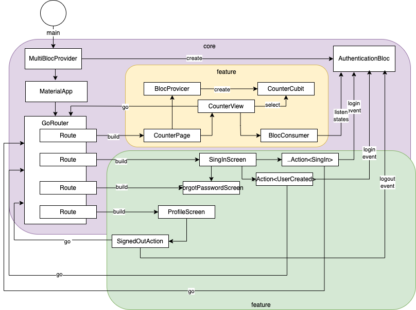
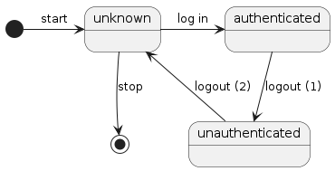

# Lifegoals

![coverage][coverage_badge]
[![style: very good analysis][very_good_analysis_badge]][very_good_analysis_link]
[![License: MIT][license_badge]][license_link]

Generated by the [Very Good CLI][very_good_cli_link] 🤖

Flutter lifegoals app

---

# Current state

Current code has been modularized with a goal to keep core and features separate. 
Within user facing features there is further modularization for presentation logic 
and shared data layer services, which can be reused by several user facing services.



Note: this approach doesn't yet have needed clarity, so it's fuzzy and is just a part of learning
process of mine. None should take it as best practice.

# Decision records

- [adr template](doc/arch/adr/adr-0000-template.md)
- [adr 0001: record important decisions using markdown](doc/arch/adr/adr-0001-record-decisions-using-adr-template.md)
- [adr 0002: use same adr template for recording all decisions](doc/arch/adr/adr-0002-use-uniform-adr-template.md)
- [adr 0003: follow "advice process" while doing decisions](doc/arch/adr/adr-0003-follow-advice-process.md)
- [adr 0004: use opinionated vgv core app template](doc/arch/adr/adr-0004-choose-app-template.md)
- [adr 0005: use bloc library for state management](doc/arch/adr/adr-0005-define-state-managament-approach.md)
- [adr 0006: use arb files and gen-l10n for localization](doc/arch/adr/adr-0006-define-localization-approach.md)
- [adr 0007: use go router for navigation](doc/arch/adr/adr-0007-define-navigation-mechanism.md)
- [adr 0008: use agv analyze to define code conventions](doc/arch/adr/adr-0008-define-linting-rules.md)

# Reflections

## CLI tooling

- VGV Cli creates with Github good development environment really fast, practices are solid.
- VGV Core template creates out of box integrations for code format, static analysis and code coverage check.

## Code quality

- There's constant tension to add code coverage, make linter happy and following own style.
- It's easy to forgot formatting dart code before pushing code to git

## State management

- Bloc seems to me easy to use and especially test, async logic and subscribing to streams feels complex.
- Bloc lifecycle needs to be controlled by my code. When I messed it Blocs weren't there, just as expected.

## Using reactive streams

- Blocs can have async long running functionality like subscription to streams - but to return data from them can't happen by emitting directly, since method that started the process has already returned.

## Code generation

- Build runner works fine, except that when generation fails it might be hard to understand why it happened.
- Blocs events & states are tedious to implement cleanly and benefit a lot from usage of Freezed.

## Routing

- Go router works well - easy api, well documented.
- Go router makes 100% code coverage challenging, and testing generally needs some extra attention.

## Missing language features: Data classes & Unions 

- Freezed saves boilerplate at Blocs events and states, but it's generator, and if generated code doesn't work or compile it's hard to debug.
- Freezed shouldn't be blamed here, since it's just generator, if world outside of it isn't ok it simply doesn't know it.
- Developer is in charge here. It's easy to forgot regeneration, and refactoring isn't that neat. 

## Cloud integration: authentication

- Firebase auth ui is easy to use, but breaks modularization of architecture, as cloud access is embedded within 3rd party components
- Firebase auth UI ties you to single cloud provider, and changing it later might be harder than necessary.
- Decision to use or not to use Firebase Auth ui boils down to question if one wants to invest on cloud independent solution

## Cloud integration: firestore noSql database

- Cloud Firestore is cool. I just don't yet manage to handle stream subscription cleanly.

## Dependency injection

- Injectable & Get_it have a programming model, which seems good to me.
- Bloc has it's own dependency handling, which doesn't intuitively match to Injectable & Get_it.
- I'm still experimenting to find how to combine (if at all) these two models.

## Host platform hassle

- Firebase and qr/barcode scanner components have problems with ios pods - result: ios is currently blocked

## Copyrights

During course of testing VGV's plugins question of licenses in generated code came up.
VGV clarified this issue in very elegant way. They dropped licencing terms from generated code,
which allows developers to set their own copyright notices in code if they wish.

https://github.com/VeryGoodOpenSource/very_good_cli/issues/210#issuecomment-1335791403

## Command you need repeatedly while experimenting

#### format code

```sh
$ dart format .
```

#### Analyze code

```sh
$ flutter analyze lib test
```

#### Measure code coverage

```sh
$ flutter test --coverage --test-randomize-ordering-seed random
$ genhtml coverage/lcov.info -o coverage/
```

or

```sh
# Run all tests and enforce 100% coverage
$ very_good test --coverage --min-coverage 100
```

#### Generate dependency configurations

just once

```sh
$ flutter packages pub run build_runner build --delete-conflicting-outputs
```

or

generate, stay watching changes and regenerating

```sh
$ flutter packages pub run build_runner watch --delete-conflicting-outputs
```

and remember: after that you need always add ignores to generated config file to pass Github build.

## Ignores needed to generated classes

#### firebase config

add to the start of the file

lib/firebase_options.dart

```
// coverage:ignore-file
// ignore_for_file: no_default_cases
```

note: you need to add these only after *flutterfire configure*

#### injectable config

add to the start of the file

lib/core/injection.config.dart

```
// coverage:ignore-file
// ignore_for_file: unnecessary_lambdas
// ignore_for_file: lines_longer_than_80_chars
// ignore_for_file: comment_references
// ignore_for_file: cascade_invocations
// ignore_for_file: require_trailing_commas
```

note: injections configuration is overwritten always when you change injectable annotations or
create class which triggers autogeneration (proposed basic configuration: bloc, repository, service).

## How to repeat creating this app

NOTE: There's currently only needed configs for "production" flavor. Running others flavors might fail.

#### Install very good cli

https://github.com/VeryGoodOpenSource/very_good_cli

https://cli.vgv.dev/

```sh
# install very good cli
$ dart pub global activate very_good_cli
```

#### Create app with very good core as base

https://github.com/VeryGoodOpenSource/very_good_core

https://cli.vgv.dev/docs/templates/core

```sh
# create app with very good cli
$ very_good create flutter_app lifegoals --description "Flutter lifegoals app" --org-name "fi.nikkijuk.lifegoals"
```

#### Configure firebase

- https://firebase.google.com/codelabs/firebase-get-to-know-flutter#2

Create account to https://firebase.google.com/

Go to Firebase console https://console.firebase.google.com/

Create firebase instance 'lifegoals'

#### install firebase cli

- https://github.com/firebase/firebase-tools

```sh
# use brew (osx) to install firebase cli
$ brew install firebase-cli
```

#### Login and Check firebase project

```sh
# login to firebase
$ firebase login

# list all projects
$ firebase projects:list
```

#### Install firebase dependencies

make sure that you are at project directory

```sh
# core
$ flutter pub add firebase_core

# authentication
$ flutter pub add firebase_auth

# authentication ui components
$ flutter pub add firebase_ui_auth

# firestore
$ flutter pub add cloud_firestore
```

Note: You might need to go to Android studio and update dependency versions manually due to incompatibility of dependencies.

#### fix problem with api levels

open android/app/build.gradle

change min sdk level to be 21 

```
    defaultConfig {
        // TODO: Specify your own unique Application ID (https://developer.android.com/studio/build/application-id.html).
        applicationId "fi.nikkijuk.lifegoals.lifegoals"
        minSdkVersion 21 // flutter.minSdkVersion
        targetSdkVersion flutter.targetSdkVersion
        versionCode flutterVersionCode.toInteger()
        versionName flutterVersionName
    }
```

NOTE: I don't know if 21 is correct version, but after this change we get forward

NOTE: You might not want to hardcode your minsdk version as it's done here.

#### create firebase configuration

this step creates *firebase_options.dart* and modifies some existing files

```sh
# create configuration files 
$ flutterfire configure
```

#### Take care of api keys

Generated / modified files contain api keys, which you might not want to commit to git.

- https://firebase.google.com/docs/projects/api-keys

See: iOS/Runner/GoogleService-Info.plist

```
	<key>API_KEY</key>
	<string><secret_you_might_not_want_to_compromize></string>
```

NOTE: It's ok'ish to share api key for firebase if your firebase security definitions are properly done. Pay attention to details.

####  Format generated firebase config

```sh
# format all files according to dart rules
$ flutter format .  
```

Note: there's some rule ignores present, but they might not be all applied 

#### Fix analyse errors in generated firebase config

```sh
# check if we have problems
$ flutter analyze lib test
```

modify generated firebase_options.dart

as it doesn't compile, and it's generated, make minimal changes to get forward.. 

- disable rule: *no_default_cases*

```
// File generated by FlutterFire CLI.
// ignore_for_file: lines_longer_than_80_chars, avoid_classes_with_only_static_members, no_default_cases
```

generated files might be regenerated later, so you don't want to make them perfect

#### Add router

- https://pub.dev/packages/go_router

```sh
# check if we have problems
$ flutter pub add go_router
```

#### make separate class to routes and router rules

lib/core/navigation.dart

#### Import go router

```
    import 'package:go_router/go_router.dart';
```

#### Add route config

- https://pub.dev/documentation/go_router/latest/topics/Get%20started-topic.html

Define routes

```
class Routes {
  static const home = '/';
}
```

Create function to build router

```
GoRouter router() => GoRouter(
      routes: [
        GoRoute(
          path: Routes.home,
          builder: (_, __) => const CounterPage(),
        )
      ],
    );
```

#### take router config in use

use router constructor 

- https://api.flutter.dev/flutter/material/MaterialApp/MaterialApp.router.html

lib/app/view/app.dart

```
    return MaterialApp.router(
      theme: ThemeData(
        appBarTheme: const AppBarTheme(color: Color(0xFF13B9FF)),
        colorScheme: ColorScheme.fromSwatch(
          accentColor: const Color(0xFF13B9FF),
        ),
      ),
      localizationsDelegates: AppLocalizations.localizationsDelegates,
      supportedLocales: AppLocalizations.supportedLocales,
      routerConfig: router(),
    );
```

#### add about page

define new route
- add "about" route 
- add router configuration which points to about page

add counter page button to navigate using new route
- add "i" icon to counter page to navigate to about page with context.go (Routes.about)

create about page component
- add navigation back to counter
- add localizations

#### fix hero tag errors

- https://api.flutter.dev/flutter/material/FloatingActionButton/heroTag.html

added hero tags while there's more than one action button in tree

#### fix 100% code coverage problem

Adding about page was ok, but test code coverage might have dropped

#### install lcov

get tools

```sh
# install lcov (osx)
$ brew install lcov
```

#### check coverage

all but 100% fail at github

```sh
# collect code coverage
$ flutter test --coverage --test-randomize-ordering-seed randomgenhtml coverage/lcov.info -o coverage/

# check if we have problems
$ genhtml coverage/lcov.info -o coverage/
```

#### Rats! Navigation needs to be tested

There isn't ready testing libraries for go router, so we need to do own helpers

Look ideas from here

- https://guillaume.bernos.dev/testing-go-router/
- https://guillaume.bernos.dev/testing-go-router-2/

#### Add mocking for router

https://pub.dev/packages/mocktail

```sh
# add mocking lib
$ flutter pub add mocktail
```

Define mocked router and provider for mocked router

```
class MockGoRouter extends Mock implements GoRouter {}

class MockGoRouterProvider extends StatelessWidget {
  const MockGoRouterProvider({
    required this.goRouter,
    required this.child,
    super.key,
  });

  /// The mock navigator used to mock navigation calls.
  final MockGoRouter goRouter;

  /// The child [Widget] to render.
  final Widget child;

  @override
  Widget build(BuildContext context) => InheritedGoRouter(
        goRouter: goRouter,
        child: child,
      );
}
```

#### Write addition test helpers

test/helpers/pump_app.dart

one helper method for mocked routes

```
extension PumpMockRouterApp on WidgetTester {
  Future<void> pumpMockRouterApp(Widget widget, MockGoRouter mockGoRouter) {
    return pumpWidget(
      MaterialApp(
        localizationsDelegates: AppLocalizations.localizationsDelegates,
        supportedLocales: AppLocalizations.supportedLocales,
        home: MockGoRouterProvider(goRouter: mockGoRouter, child: widget),
      ),
    );
  }
}
```

one helper method without mocking for app startup

```
extension PumpRealRouterApp on WidgetTester {
  Future<void> pumpRealRouterApp(GoRouter router) {
    return pumpWidget(
      MaterialApp.router(
        localizationsDelegates: AppLocalizations.localizationsDelegates,
        supportedLocales: AppLocalizations.supportedLocales,
        routeInformationParser: router.routeInformationParser,
        routerDelegate: router.routerDelegate,
      ),
    );
  }
}
```

NOTE: If there is persistent state which needs to be filled in state management 
and changes routing rules this logic will become later more complicated 
or test will need to do setup before building app.

NOTE: Might not work with deep linking currently. Not tested as web is not primary target.

#### Write test for default root (/)

```
    testWidgets('renders CounterPage via Router as home screen',
        (tester) async {
      await tester.pumpRealRouterApp(router());
      expect(find.byType(CounterView), findsOneWidget);
      expect(find.byType(BackButton), findsNothing);
    });
```

Note: This test should select "/" route as default.

#### Write tests which use mocked router

```
    testWidgets('is redirected when button is tapped', (tester) async {
      final mockGoRouter = MockGoRouter();

      await tester.pumpMockRouterApp(const CounterPage(), mockGoRouter);

      await tester.tap(find.byIcon(Icons.info));
      await tester.pumpAndSettle();

      verify(() => mockGoRouter.go(Routes.about)).called(1);
      verifyNever(() => mockGoRouter.go(Routes.home));
    });
  });
```

#### Set ignores when nothing else helps

Read docs https://pub.dev/packages/coverage

- Use *// coverage:ignore-line* to ignore one line. 
- Use *// coverage:ignore-start* and *// coverage:ignore-end* to ignore range of lines inclusive. 
- Use *// coverage:ignore-file* to ignore the whole file.

NOTE: this is needed as route builders are not used while testing - they are mocked, so: never called.

#### Add firebase initialization

lib/core/appconfig.dart

```
Future<void> initFirebase() async {
  await Firebase.initializeApp(
    options: DefaultFirebaseOptions.currentPlatform,
  );

  // tests never get this far.. even if tests should use this method
  FirebaseUIAuth.configureProviders([
    EmailAuthProvider(),
  ]);
}
```

Now you have *EmailAuthProvider()* in use, 
so please also configure firebase to allow this authentication method.

#### Create needed screens for signup / login, forgot password and profile

Each screen needs function which creates it when go router is asking to create widgets for route

lib/core/appconfig.dart

```
/// Sing in to app
Widget singInScreen(BuildContext context) {
  return SignInScreen(
    actions: [
      ForgotPasswordAction(
        (context, email) => context
            .goNamed(Routes.forgotPasswordName, params: {'email': email ?? ''}),
      ),
      AuthStateChangeAction<SignedIn>((context, state) {
        final user = state.user;
        if (user != null) {
          _showVerifyEmailMessage(context, user);
        }
        context.go(Routes.home);
      }),
      AuthStateChangeAction<UserCreated>((context, state) {
        final user = state.credential.user;
        if (user != null) {
          user.updateDisplayName(user.email!.split('@')[0]);
          _showVerifyEmailMessage(context, user);
        }
        context.go(Routes.home);
      }),
    ],
  );
}

void _showVerifyEmailMessage(BuildContext context, User user) {
  final verificationNeeded = !user.emailVerified;
  if (verificationNeeded) {
    user.sendEmailVerification();
    const snackBar = SnackBar(
      // TODO(jnikki): localize
      content: Text('Please check your email to verify your email address'),
    );
    ScaffoldMessenger.of(context).showSnackBar(snackBar);
  }
}

/// User has forgotten password
Widget forgotPasswordScreen(BuildContext context, GoRouterState state) {
  final email = state.params['email'] ?? '';
  return ForgotPasswordScreen(email: email, headerMaxExtent: 200);
}

/// User profile
Widget profileScreen(BuildContext context) {
  return ProfileScreen(
    providers: const [],
    actions: [
      SignedOutAction((context) => context.go(Routes.home)),
    ],
  );
}
```

note: this file is currently ignored from code coverage, 
testing it would not be impossible but possibly complicated.

#### add missing routes

forgot password uses named routes, all other is just like before

ignores are used here since calls to routes are mocked and thus never used

```
class Routes {
  static const home = '/';
  static const about = '/about';
  static const login = '/login';
  static const logout = '/logout';
  static const profile = '/profile';
  static const forgotPasswordName = 'forgot';
  static const forgotPasswordPath = '/forgot/:email';
}

GoRouter router() => GoRouter(
      routes: [
        GoRoute(
          path: Routes.home,
          builder: (ctx, state) => const CounterPage(),
        ),
        GoRoute(
          path: Routes.about,
          builder: (ctx, state) => const AboutPage(), // coverage:ignore-line
        ),
        GoRoute(
          path: Routes.login,
          builder: (ctx, state) => singInScreen(ctx), // coverage:ignore-line
        ),
        GoRoute(
          path: Routes.profile,
          builder: (ctx, state) => profileScreen(ctx), // coverage:ignore-line
        ),
        GoRoute(
          name: Routes.forgotPasswordName,
          path: Routes.forgotPasswordPath,
          builder: forgotPasswordScreen, // coverage:ignore-line
        )
      ],
    );
```

#### install get_it & injectable (experimenting)

add get_it and injectable libraries and code generator for configurations

```sh
$ flutter pub add get_it
$ flutter pub add injectable
$ flutter pub add --dev injectable_generator
```

create configuration file & method method

- lib/core/injection.dart

```
final getIt = GetIt.instance;

@InjectableInit()
void configureDependencies() => getIt.init();
```

generate configs

```sh
$ flutter packages pub run build_runner build --delete-conflicting-outputs
```

Note: At start generation didn't work for me. I needed to add some annotation and not rely
on automatic rules (build.yaml) only and then it started to work.

#### add auto generator for injections (option)

- build.yaml

```
targets:
  $default:
    builders:
      injectable_generator:injectable_builder:
        options:
          auto_register: true
          # auto registers any class with a name matches the given pattern
          class_name_pattern:
            "Service$|Repository$|Bloc$"
          # auto registers any class inside a file with a
          # name matches the given pattern
          file_name_pattern: "_service$|_repository$|_bloc$"
```

Note: also injectable & getit aren't used (at least yet)

#### add freezed

bloc library is fine, but needs events and states to be implemented as classes. 
Handwritten equality, toString & other needed code can lead to lot of boilerplate code, 
which is tedious to keep up during development.

freezed is generator which makes it easy to reduce boilerplate. 

- https://pub.dev/packages/freezed

we currently only need these

```sh
$ flutter pub add freezed_annotation
$ flutter pub add --dev build_runner
$ flutter pub add --dev freezed
```

as we want to have option to json serialization/deserialization we need also

```sh
$ flutter pub add json_annotation
$ flutter pub add --dev json_serializable
```

Json serialization comes really handy when we start using Cloud Firestore to access noSql cloud database.

#### Authentication: events + states

I created events for login and logout. Events are added to block when user
does action which should change state of authenticated session (create or revoke users authenticated session).

```
@freezed
abstract class AuthenticationEvent with _$AuthenticationEvent {
  const factory AuthenticationEvent.login() = LogIn;
  const factory AuthenticationEvent.logout() = LogOut;
}
```

Allowed states are unknown, authenticated and unauthenticated. For actions which should trigger action
during logout unauthenticated is emitted during logout, and directly after that unknown.

```
@freezed
abstract class AuthenticationState with _$AuthenticationState {
  const factory AuthenticationState.unknown() = Unknown;
  const factory AuthenticationState.authenticated() = Authenticated;
  const factory AuthenticationState.unauthenticated() = Unauthenticated;
}
```

All events and states use mixin, which is generated by Freezed. 
Code is generated to separate class, which keeps event and state classes clean and readable.

#### Commit generated code to git

Freezed generates files for you. They follow naming convention <my_file>.freezed.dart. 
<my_file> is name of source file which contains @freezed annotated classes.

I don't know if it would be possible to do generation at CI/CD pipeline, 
but now I only know that they can be just pushed to Git, even if it feels somehow wrong.

I would like to generate code to separate source tree and take it in use from there,
but this is something I'll see separately later.

#### documenting bloc logic

With bloc it's mandatory to define states and events clearly. After this logic is simple.

How about sharing thoughts as diagram? State diagram comes here handy.



Below is plantuml text presentation of authentication blocs logic.

```
@startuml
	[*] -right-> unknown: start
	unknown -down-> [*]: stop
	unknown -right-> authenticated: log in
	authenticated -down-> unauthenticated: logout (1)
	unauthenticated --> unknown: logout (2)
@enduml
```

It's easy to see from state diagram which state changes are allowed, which events trigger
state changes, and so it will become evident how 
bloc is used (contract) and how it should work (implementation of contract).

#### implementing bloc logic

Code for authentication bloc is really simple, initial state is Unknown, login and logout events 
only emit states, to which app reacts as appropriate.

```
class AuthenticationBloc
    extends Bloc<AuthenticationEvent, AuthenticationState> {
  AuthenticationBloc() : super(const Unknown()) {
    on<LogIn>(_login);
    on<LogOut>(_logout);
  }

  FutureOr<void> _login(LogIn event, Emitter<AuthenticationState> emit) {
    state.maybeWhen(
      unknown: () => emit(const Authenticated()),
      orElse: () {}, // coverage:ignore-line
    );
  }

  FutureOr<void> _logout(LogOut event, Emitter<AuthenticationState> emit) {
    state.maybeWhen(
      authenticated: () {
        emit(const Unauthenticated());
        emit(const Unknown());
      },
      orElse: () {}, // coverage:ignore-line
    );
  }
}
```

It's important to understand that this code is taking in account current state, and 
state changes only happen if they are valid according current state of bloc.

Error handling is not implemented, it could be easily added to "orElse" handler.

See example of using when from documentation

- https://pub.dev/packages/freezed#using-pattern-matching-to-read-non-shared-properties

#### authentication bloc testing

Authentication bloc can be tested like any other bloc. 

It is important to note, that to test logout one needs first to do login. 
This is because one doesn't only need to fire event, but bloc needs to have right state
or it doesn't act accordingly.

I have done some experiments with dependency injection, even if it's not really in use,
so we need to load dependency injection definitions in memory.

#### add setup and teardown to tests for di

Dependency injection rules need to be loaded to memory, but they can be loaded only once.

Each test that needs to use injected resources needs setup & teardown methods.

setUpAll & tearDownAll are run before all tests in test file and after all tests have been executed.

```
void main() {
  setUpAll(configureDependencies);

  tearDownAll(getIt.reset);
```

NOTE: teardown is not needed if tests are executed one by one, but vgv combines cleverly
tests together so that they are faster to execute, which also means that once initialized
getit definitions need to be either shared with all tests or setup / dispose needs to be done per test.

Alternative test setup build could be usage of *flutter_test_config.dart*. Please see more from official docs.

- https://api.flutter.dev/flutter/flutter_test/flutter_test-library.html

#### add mocking of authentication bloc to tests

Create mocked authentication bloc class

```
class MockAuthencationBloc
    extends MockBloc<AuthenticationEvent, AuthenticationStatus>
    implements AuthenticationBloc {}
```

now we need to 

- create instance of mocked bloc
- define what happens when someone interacts with it (here: reads initial state)
- pass it to pumpMockRouterApp, which is changed to support mocked authentication state

```
     testWidgets('is redirected when profile button is tapped',
          (tester) async {
        final mockGoRouter = MockGoRouter();

        final mockAuthenticationBloc = MockAuthencationBloc();

        // TODO(jnikki): handling of initial state is blurry

        // Stub the state stream
        whenListen(
          mockAuthenticationBloc,
          Stream.fromIterable([AuthenticationStatus.authenticated]),
          initialState: AuthenticationStatus.authenticated,
        );

        await tester.pumpMockRouterApp(
          const CounterPage(),
          mockGoRouter,
          mockAuthenticationBloc,
        );

        await tester.tap(find.byIcon(Icons.verified_user));
        await tester.pumpAndSettle();

        verify(() => mockGoRouter.go(Routes.profile)).called(1);
        verifyNever(() => mockGoRouter.go(Routes.home));
      });
```

Our extension for testing mocked apps has been grown meanwhile

parameter

- we still have widget as parameter
- and allow called to pass in mocked router 
- but we have also authentication bloc as parameter

logic has similarities to real app

- we initialize firebase
- we create material app which has routing rules
- we create provider for authentication bloc above material app
- then we pump widget up

```
extension PumpMockRouterApp on WidgetTester {
  /// pumpMockRouterApp can be used when mocked routing is needed in test
  /// Mocking authentication bloc allows changing easily user state
  Future<void> pumpMockRouterApp(
    Widget widget,
    MockGoRouter mockGoRouter,
    AuthenticationBloc bloc,
  ) {
    initFirebase();

    final app = MaterialApp(
      localizationsDelegates: AppLocalizations.localizationsDelegates,
      supportedLocales: AppLocalizations.supportedLocales,
      home: MockGoRouterProvider(goRouter: mockGoRouter, child: widget),
    );

    final fullApp = MultiBlocProvider(
      providers: [
        BlocProvider<AuthenticationBloc>(create: (_) => bloc),
      ],
      child: app,
    );

    return pumpWidget(fullApp);
  }
```

#### Blocs & Dependency injection?

Blocs lifecycle and access to it is controlled by widgets it's connected with.

- Bloc defined using BlocProvider above MaterialApp is global
- Global Bloc is shared to whole Presentation layer using buildContext
- BuildContext can be passed using callbacks to further logic, which is quite handy 

With DI you often have one copy (single instance) of something 
created by your DI mechanism and inject it somewhere else. 

- Blocks can have repository injected to them
- Repository might have storage client injected
- Now we can have in test different storage client as during production

I'm trying to find middle way here, since it seems to me that even if domain layer might need
DI / services locators / etc.. presentation layer lives very differently based on bloc and widget / element tree.

#### Adding barcode scanner

I added barcode scanner just to see how to add one more function

- https://pub.dev/packages/mobile_scanner

Adding was simply, define ui with mobile scanner and display for code and add callback handler for barcode coming from mobile scanner. 

Here ui snippet

```
      body: MobileScanner(
        controller: cameraController,
        onDetect: (barcode, args) {
          final code = barcode.rawValue;
          handleReadBarcode(context, code);
        },
      ),
      bottomNavigationBar: const ScannedCode(),
    );
  }
```

here how to give read barcode to bloc

```
 void handleReadBarcode(BuildContext context, String? code) {
    switch (code) {
      case null:
        context.read<ScannerBloc>().add(const ReadFailed());
        break;
      default:
        context.read<ScannerBloc>().add(ReadSucceeded(code!));
        break;
    }
  }
```

And ui component which repaints when bloc state changes

```
class ScannedCode extends StatelessWidget {
  const ScannedCode({super.key});

  @override
  Widget build(BuildContext context) {
    return BlocBuilder<ScannerBloc, ScannerState>(
      builder: (context, state) => state.maybeWhen(
        found: Text.new,
        orElse: () => const Text('N/A'),
      ),
    );
  }
}
```

With android it functioned without any changes to native shell, with ios rights need to be added.

plist.info

```
<key>NSCameraUsageDescription</key>
<string>This app needs camera access to scan QR codes</string>
```

And there seems to be dependency conflict at ios because of Firebase / ML Toolkit, so; 
I haven't really managed to test iOS implementation, but I guess that after some tweaking
it would work

- https://issuetracker.google.com/issues/254418199?pli=1#comment48

Tricky part was setting up testing. I used high amount of time to mock needed infrastructure.

This is variant where bloc is directly mocked to return requested state.

```
      testWidgets('code is shown when barcode is read', (tester) async {
        final ScannerBloc mockScannerBloc = MockScannerBloc();

        when(() => mockScannerBloc.state).thenReturn(const Found('123'));

        await tester.pumpAppWithProvider(
          const ScannerView(),
          BlocProvider<ScannerBloc>(
            create: (_) => mockScannerBloc,
          ),
        );

        await tester.pumpAndSettle();

        expect(find.text('123'), findsOneWidget);
      });
```

Here is needed helper method to setup app for testing

```
  Future<void> pumpAppWithProvider(Widget widget, BlocProvider provider) {
    initFirebase();

    final app = MaterialApp(
      localizationsDelegates: AppLocalizations.localizationsDelegates,
      supportedLocales: AppLocalizations.supportedLocales,
      home: widget,
    );

    final fullApp = MultiBlocProvider(
      providers: [
        BlocProvider<AuthenticationBloc>(create: (_) => AuthenticationBloc()),
        provider,
      ],
      child: app,
    );

    return pumpWidget(fullApp);
  }
}
```

It seemed to me that at least some of my problems were up to not using types correctly, 
for example when building widgets *BlocProvider<ScannerBloc>*  seemed to need 
type of bloc or otherwise bloc couldn't be found from tree.

Note that what I have done here is just to give one fully built provider to 
method that I have extended from previous helper methods. 
It seems to me that currently it's nicer to have many simple methods than try to write
test method which can handle lot of needs and is starting to be complex. 
so: copy & paste coding allowed, cleanup happens maybe at some point. 

#### Logging

There's plenty of logging libraries present. This felt decent to me.

```sh
$ flutter pub add logging
```

To actually see logs it needs to be defined which log levels are shown and how. 
For now I use very simple implementation.

```
void initLogging({Level level = Level.INFO}) {
  Logger.root.level = level;
  Logger.root.onRecord.listen((record) {
    // TODO(jnikki): should be replaced with something more useful
    // ignore: avoid_print
    print('${record.level.name}: ${record.time}: ${record.message}');
  });
}
```

To log there needs to be log object defined. Just use it to access Loger.

```
final log = Logger('MyClassName');
```

#### Launcher icons

I was tempted to try replacing launcher icons, but decided to postpone it for later

- https://pub.dev/packages/flutter_launcher_icons

There's dall-e generated icon in repository and definitions at pubspec.yaml,
but this doesn't cover flavors, so I reserve time later to do this properly

```
flutter_icons:
  image_path: "assets/icon.png"
  android: true
  ios: true
```

It is completely possible to try generation out of box, but like said,
results are not useful in this particular project.

```sh
$ flutter pub run flutter_launcher_icons
```

#### Bloc: provide & consume

it is well documented how to setup bloc provider and consume it

- https://bloclibrary.dev/#/recipesflutterblocaccess?id=ui

Example
- Inject bloc to widget tree using BlocProvider<MyBloc>
- Pick bloc from widget tree using BlocConsumer<MyBloc, MyBlocState> 

Typically you can 
- Use MyTaskPage to create provider and wrap MyTaskWidget as it's child
- MyTaskWidget declares ui, and is able to pick up provided blocs

We might want to divide app to features, in which case we have
- Applications core, shared functionality like navigation, etc.
- Features, local pages and widgets for limited functionality

There might be blocs on app level (global) and page level (local) and everywhere between. 

Limiting scope is useful, since it creates boundaries for testing.

#### Testing blocs

Testing blocks in isolation is straightforward using  bloc_test

- https://pub.dev/packages/bloc_test

example: When "read" event happens "found" state should be emitted

```
      blocTest<ScannerBloc, ScannerState>(
        'emits [Found(123)] when [ReadSucceeded(123)] happens}',
        build: ScannerBloc.new,
        act: (bloc) => bloc.add(const ReadSucceeded('123')),
        expect: () => [const Found('123')],
      );
```

This is all actually really cool. 
Easy to read simple syntax for building bloc, initiating action on it and checking resulting state.

#### Mocking blocks

Block can be mocked

- https://pub.dev/documentation/bloc_test/latest/bloc_test/MockBloc-class.html

Testing features which use blocks can be done by injecting mocked blocks to feature and
by replacing bloc that wraps pages widgets with mocked one.

Mocking seems simple, but care needs to be given to type definitions, 
or otherwise one starts to have difficulties which manifest themselves with
hard to understand error messages or as wrong mock functionality.

Defining mock using proper types for events and states 

```
class MockScannerBloc extends MockBloc<ScannerEvent, ScannerState>
    implements ScannerBloc {}
```

Mocks needs to be set up before tests methods run

```
  group('test', () {
    late ScannerBloc bloc;

    setUp(() {
      bloc = MockScannerBloc();
    });
```

Just mocking single methods of bloc is possible.

Note: pumpWidget is custom help method which is part of project.

```
    testWidgets('code found', (tester) async {
      when(() => bloc.state).thenReturn(const Found('123'));

      await tester.pumpWidget(
        BlocProvider.value(
          value: bloc,
          child: const MaterialApp(home: ScannerView()),
        ),
      );

      expect(find.text('123'), findsOneWidget);
    });
  });
```

But it's also possible to stub state stream and not mock methods.

- https://pub.dev/documentation/bloc_test/latest/bloc_test/whenListen.html

```
      testWidgets('code is not shown before barcode is read', (tester) async {
        final ScannerBloc mockScannerBloc = MockScannerBloc();

        // Stub the state stream
        whenListen(
          mockScannerBloc,
          Stream<ScannerState>.fromIterable([const Inactive()]),
          initialState: const Inactive(),
        );

        final provider =
            BlocProvider<ScannerBloc>(create: (_) => mockScannerBloc);

        await tester.pumpAppWithProvider(
          const ScannerView(),
          provider,
        );

        await tester.pumpAndSettle();
        expect(find.text('N/A'), findsOneWidget);
      });
```

All that is fanncy, and makes testing possible, 
but it's still hard to grasp at the very start and writing good tests can take some time.

#### Bloc dependency management

Bloc library knows two types of components to inject / provide

- Blocks can be provided with MultiBlocProvider or BlocProvider
- Repositories can be provided with MultiRepositoryProvider or RepositoryProvider

Reporitories are define as 

- It is used as a dependency injection (DI) widget so that a single instance of a repository can be provided to multiple widgets within a subtree.

For me this is bit restricting, since first it provides restrictive naming convention (everything is either bloc or repository),
and to me repository doesn't naturally feel like being top level component which is defined app level and injected to blocks when they are created.

Creating app definitions starts to look like this
- Outer scope: Repository definitions with MultiRepositoryProvider
- First embedded scope: Bloc definitions with MultiBlocProvider 
- Second embedded scope: App itself

```
final app = MaterialApp.router(
      theme: ThemeData(
        appBarTheme: const AppBarTheme(color: Color(0xFF13B9FF)),
        colorScheme: ColorScheme.fromSwatch(
          accentColor: const Color(0xFF13B9FF),
        ),
      ),
      localizationsDelegates: AppLocalizations.localizationsDelegates,
      supportedLocales: AppLocalizations.supportedLocales,
      routerConfig: router(),
    );

    final blocProviders = MultiBlocProvider(
      providers: [
        BlocProvider<AuthenticationBloc>(create: (_) => AuthenticationBloc()),
      ],
      child: app,
    );

    return MultiRepositoryProvider(
      providers: [
        RepositoryProvider<TodoRepository>(
          create: (_) => FirebaseTodoRepository(FirebaseFirestore.instance),
        ),
      ],
      child: blocProviders,
    );

```

But why all this: well, whem creating local blocks within feature 
it's possible to get repository from global widget tree.

Dependency injection implemented: well done.. 
now it's possible to change repository definitions and as long as 
widget tree contains real or mocked provider running in production
or testing with widget test just works.

Here we see TodosPage which is just wrapper for TodosView, and actual tests 
can use TodosView directly. So, now you don't get 100% code coverage,
but are pretty close anyway.

```
class TodosPage extends StatelessWidget {
  const TodosPage({super.key});

  @override
  Widget build(BuildContext context) {
    return BlocProvider(
      create: (_) => TodoBloc(context.read<TodoRepository>()),
      child: const TodosView(),
    );
  }
}

class TodosView extends StatelessWidget {
  const TodosView({super.key});

  @override
  Widget build(BuildContext context) {
    return Scaffold(
```

See repository related class docs

- https://pub.dev/documentation/flutter_bloc/latest/flutter_bloc/RepositoryProvider-class.html
- https://pub.dev/documentation/flutter_bloc/latest/flutter_bloc/MultiRepositoryProvider-class.html

This all corresponds nicely to architecture presented at bloc library documentation

https://bloclibrary.dev/#/architecture?id=data-layer

And, while this works and is propably completely ok for most apps, 
I wonder if it's best way to when modularity of app is important architectural requirement.

On the other hand, Blocs libraries architectural ideas are solid, so repositories have clear role within
described architecture.

- https://bloclibrary.dev/#/architecture?id=data-layer

#### Cloud Firestore access

As a good citizen one needs to have

- interface for repository
- firebase implementation
- and mocks for testing

#### Generating database keys

One can let database to generate keys or generate them in client side.

I decided to use plugin *uuid* to client side generation.

- https://pub.dev/packages/uuid

Installation

```
$ flutter pub add uuid
```

Generation

```
// introduce generator
var uuid = Uuid();


// Generate a v4 (random) id
final id = uuid.v4()
```

There's also other algorithms, but this seemed to be fitting as it creates random id's 
using cryptography algorithm.

See firebase best practices to review why using ordered keys would have been bad option.

- https://firebase.google.com/docs/firestore/best-practices

#### Repository interface

Dart doesn't really have interfaces. What to do? 

*Dart has no interface keyword. Instead, all classes implicitly define an interface.*
- https://dart.dev/samples#interfaces-and-abstract-classes

Simply: we do abstract class

```
abstract class TodoRepository {
  Stream<Iterable<Todo>> todos();

  Future<Todo?> findTodo(String id);

  Future<void> saveTodo(Todo todo);

  Future<void> deleteTodo(Todo todo);
}
```

Methods return future or stream.  

Future and Streams are giving you promise of value which is returned async.

#### Cloud Firestore mock

Mocks are the easy part, as we use fake_cloud_firestore, 
which means we can skip mocking our own code and instead 
replace firestore connection with mock implementation.

- https://pub.dev/packages/fake_cloud_firestore/example

#### Creating firestore repository

When building repository we pass firestore instance 
to repository using constructor injection.

```
class FirebaseTodoRepository implements TodoRepository {
  FirebaseTodoRepository(this._instance) {
    // Create an instance of a collection withConverter.
    // there might be some limitations on this, but ..
    // https://github.com/firebase/flutterfire/issues/7264
    collection = _instance.collection('todos').withConverter<Todo>(
          fromFirestore: (snapshot, _) => Todo.fromJson(snapshot.data()!),
          toFirestore: (todo, _) => todo.toJson(),
        );
  }

  late final FirebaseFirestore _instance;
  late CollectionReference<Todo> collection;
```

We have used here withConverter to define 
serialization and de-serialization using methods 
Freezed has generated to us for json conversation.

Important: now model used by firebase needs to compatible with 
one generated, and we need to take care that data stays consistent.

#### Implementing firestore access

I don't feel confident with reactive streams, firestore and async error handling yet,
so this example is about to be altered later when I have more understanding

Methods are commented lightly, and show where there's still uncertainty from my side.

```
  @override
  Stream<Iterable<Todo>> todos() {
    final snapshots = collection.snapshots();

    return snapshots.map((event) {
      return event.docs.map((e) => e.data());
    });
  }

  @override
  Future<void> deleteTodo(Todo todo) async {
    final ref = collection.doc(todo.id);

    // Deletes the current document from the collection.
    return ref.delete();
  }

  @override
  Future<void> saveTodo(Todo todo) {
    final ref = collection.doc(todo.id);

    // Sets data on the document, overwriting any existing data.
    return ref.set(todo);
  }

  @override
  Future<Todo?> findTodo(String id) async {
    final ref = collection.doc(id);

    // Reads the document referenced
    final snapshot = await ref.get();
    return snapshot.data();
  }
}
```

Note that I have combined insert & update operation to one save, which relies on 
identity of todo to be present in id field.

#### Firestore repository tests

Testing stream subscription needs

- Set up fake firestore connection
- Set up repository to be tested
- (optional) fill fake firestore using repository (saveTodo)
- subscribe to stream (todos)
- listen stream
- check if stream returns excepted content

```
      setUp(() async {
        instance = FakeFirebaseFirestore();
      });

      test('initial state is empty', () async {
        final repository = FirebaseTodoRepository(instance);
        final stream = repository.todos();
        StreamSubscription<Iterable<Todo>>? subscription;
        subscription = stream.listen((event) {
          expect(event.length, 0);
          subscription?.cancel();
        });
      });

      test('initial state is not empty', () async {
        final repository = FirebaseTodoRepository(instance);
        await repository.saveTodo(todo);
        final stream = repository.todos();
        StreamSubscription<Iterable<Todo>>? subscription;
        subscription = stream.listen((event) {
          event.toList().forEach((todo) => print('found $todo'));
          expect(event.length, 1);
          subscription?.cancel();
        });
      });
```

all other tests are pretty straightforward. I have used fake firestore implementation to 
see if operation has changed state as expected, but it had bugs at time of writing this, 
so be careful not to trust in it alone.

```
      test('delete todos', () async {
        final repository = FirebaseTodoRepository(instance);
        await repository.saveTodo(todo);
        final pre = (instance as FakeFirebaseFirestore).dump();
        await repository.deleteTodo(todo);
        final foundTodo = await repository.findTodo(todo.id);
        print('found $foundTodo.');
        expect(foundTodo, null);
        print('pre $pre');
        expect(pre.contains('armageddon'), true);

        // dump doesn't seem to be in sync
        // todo which can't be retrieved is still seen on dump
        //final post = (instance as FakeFirebaseFirestore).dump();
        //print('post $post');
        //expect (post.contains("armageddon"), false);
      });
```

#### Integrating todo repository to todo bloc

Todo bloc is interesting piece of code, since it does lot of stuff

- let todo repository to be injected using constructor injection
- is able to subscribe to stream provided by todo repository
- is able to emit streamed results of todo repository as state stream
- is able to add todos with generated id
- is able to update todos identified by id
- is able to delete todos identified by id
- is able to close subscription when repository is closed

```
class TodoBloc extends Bloc<TodoEvent, TodoState> {
  TodoBloc(this._todoRepository) : super(const Uninitialized()) {
    on<Subscribe>(_subscribe);
    on<Refresh>(_refresh);
    on<Add>(_add);
    on<Update>(_update);
    on<Remove>(_remove);
  }
  final TodoRepository _todoRepository;
  StreamSubscription<Iterable<Todo>>? _subscription;
  final _uuid = const Uuid();

  Future<FutureOr<void>> _subscribe(
    Subscribe event,
    Emitter<TodoState> emit,
  ) async {
    // subscribe can be currently done multiple times, so ..
    if (_subscription != null) {
      await _subscription?.cancel(); // coverage:ignore-line
    }
    _subscription = _todoRepository.todos().listen((event) {
      add(Refresh(event.toList()));
    });
  }

  Future<FutureOr<void>> _refresh(
    Refresh event,
    Emitter<TodoState> emit,
  ) async {
    emit(Active(event.todos));
  }

  FutureOr<void> _add(Add event, Emitter<TodoState> emit) async {
    final id = _uuid.v4();
    final todo = event.todo.copyWith(id: id);

    await _todoRepository.saveTodo(todo);
  }

  FutureOr<void> _update(Update event, Emitter<TodoState> emit) async {
    await _todoRepository.saveTodo(event.todo);
  }

  FutureOr<void> _remove(Remove event, Emitter<TodoState> emit) async {
    await _todoRepository.deleteTodo(event.todo);
  }

  @override
  Future<void> close() {
    _subscription?.cancel();
    return super.close();
  }
}
```

#### Testing todo bloc

Mocking is bit tricky on todo bloc test, but otherwise it's very straightforward

#### firestore security rules

At some point unauthenticated access is not ok anymore, and at that point
firestore security rules need to be defined.

Authentication rules are documented at https://firebase.google.com/docs/rules/rules-and-auth

Simplest rule is this: user needs to be authenticated.

```
rules_version = '2';
service cloud.firestore {
  match /databases/{database}/documents {
    match /{document=**} {
      allow read, write: if
      		request.auth != null;
    }
  }
}
```

#### Changing version used by Github

For some reason VGV templates specify exact Flutter version to use. This value needs to be kept actual,
or at some point dependency management is reporting strange errors.

Please see *.github/workflows/main.yaml* and especially *flutter_version*

```
name: lifegoals

on: [pull_request, push]

jobs:
  semantic-pull-request:
    uses: VeryGoodOpenSource/very_good_workflows/.github/workflows/semantic_pull_request.yml@v1

  build:
    uses: VeryGoodOpenSource/very_good_workflows/.github/workflows/flutter_package.yml@v1
    with:
      flutter_channel: stable
      flutter_version: 3.7.0
```

Documentation is at https://github.com/VeryGoodOpenSource/very_good_workflows

One could consider setting minimum code coverage

- https://github.com/VeryGoodOpenSource/very_good_workflows#min_coverage-1

Or be forced to disable test optimization (joining test files might break them)

- https://github.com/VeryGoodOpenSource/very_good_workflows#test_optimization

So it's useful to see given configuration possibilities and be prepared to change them if needed.

## Ignoring linting on generated files

you can analyze code quality easily

```sh
$ flutter analyze lib test 
```

but for correcting linting problems on generated files -- not a good idea..

it's easy to exclude given files from analyze, and this is what I did

```sh
include: package:very_good_analysis/analysis_options.3.1.0.yaml

analyzer:
  exclude:
    - "lib/**/*.g.dart"
    - "lib/**/*.freezed.dart"
    - "lib/**/*.mocks.dart"

linter:
  rules:
    public_member_api_docs: false
```

See further options at https://dart.dev/guides/language/analysis-options

## Flavors 🚀

This project contains 3 flavors:

- development
- staging
- production

To run the desired flavor either use the launch configuration in VSCode/Android Studio or use the following commands:

```sh
# Development
$ flutter run --flavor development --target lib/main_development.dart

# Staging
$ flutter run --flavor staging --target lib/main_staging.dart

# Production
$ flutter run --flavor production --target lib/main_production.dart
```

_\*Lifegoals works on iOS, Android, Web, and Windows._

---

## Running Tests 🧪

To run all unit and widget tests use the following command:

```sh
$ flutter test --coverage --test-randomize-ordering-seed random
```

To view the generated coverage report you can use [lcov](https://github.com/linux-test-project/lcov).

```sh
# Generate Coverage Report
$ genhtml coverage/lcov.info -o coverage/

# Open Coverage Report
$ open coverage/index.html
```

--- 

## Working with Translations 🌐

This project relies on [flutter_localizations][flutter_localizations_link] and follows the [official internationalization guide for Flutter][internationalization_link].

### Adding Strings

1. To add a new localizable string, open the `app_en.arb` file at `lib/l10n/arb/app_en.arb`.

```arb
{
    "@@locale": "en",
    "counterAppBarTitle": "Counter",
    "@counterAppBarTitle": {
        "description": "Text shown in the AppBar of the Counter Page"
    }
}
```

2. Then add a new key/value and description

```arb
{
    "@@locale": "en",
    "counterAppBarTitle": "Counter",
    "@counterAppBarTitle": {
        "description": "Text shown in the AppBar of the Counter Page"
    },
    "helloWorld": "Hello World",
    "@helloWorld": {
        "description": "Hello World Text"
    }
}
```

3. Use the new string

```dart
import 'package:lifegoals/l10n/l10n.dart';

@override
Widget build(BuildContext context) {
  final l10n = context.l10n;
  return Text(l10n.helloWorld);
}
```

### Adding Supported Locales

Update the `CFBundleLocalizations` array in the `Info.plist` at `ios/Runner/Info.plist` to include the new locale.

```xml
    ...

    <key>CFBundleLocalizations</key>
	<array>
		<string>en</string>
		<string>es</string>
	</array>

    ...
```

### Adding Translations

1. For each supported locale, add a new ARB file in `lib/l10n/arb`.

```
├── l10n
│   ├── arb
│   │   ├── app_en.arb
│   │   └── app_es.arb
```

2. Add the translated strings to each `.arb` file:

`app_en.arb`

```arb
{
    "@@locale": "en",
    "counterAppBarTitle": "Counter",
    "@counterAppBarTitle": {
        "description": "Text shown in the AppBar of the Counter Page"
    }
}
```

`app_es.arb`

```arb
{
    "@@locale": "es",
    "counterAppBarTitle": "Contador",
    "@counterAppBarTitle": {
        "description": "Texto mostrado en la AppBar de la página del contador"
    }
}
```

[coverage_badge]: coverage_badge.svg
[flutter_localizations_link]: https://api.flutter.dev/flutter/flutter_localizations/flutter_localizations-library.html
[internationalization_link]: https://flutter.dev/docs/development/accessibility-and-localization/internationalization
[license_badge]: https://img.shields.io/badge/license-MIT-blue.svg
[license_link]: https://opensource.org/licenses/MIT
[very_good_analysis_badge]: https://img.shields.io/badge/style-very_good_analysis-B22C89.svg
[very_good_analysis_link]: https://pub.dev/packages/very_good_analysis
[very_good_cli_link]: https://github.com/VeryGoodOpenSource/very_good_cli
